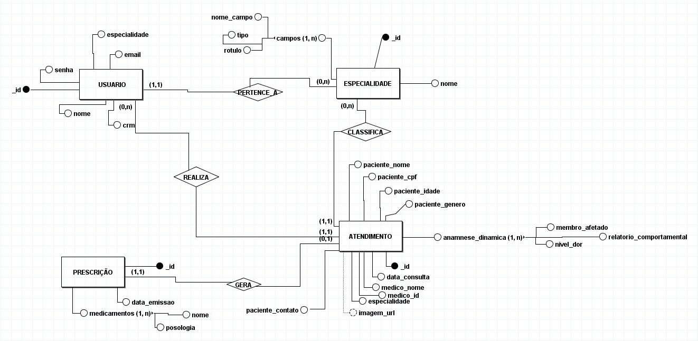
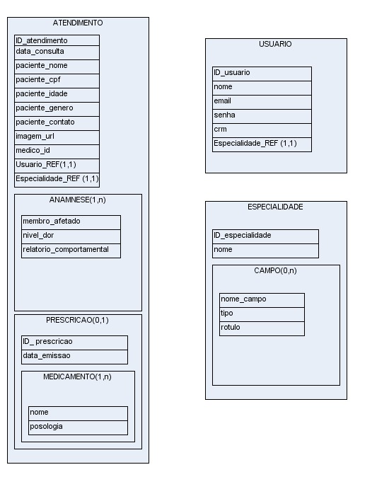
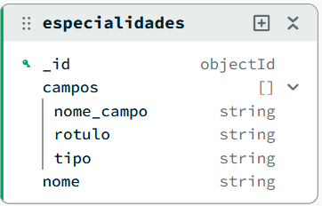
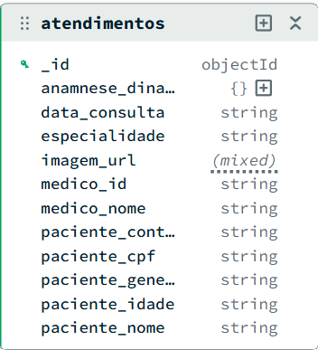
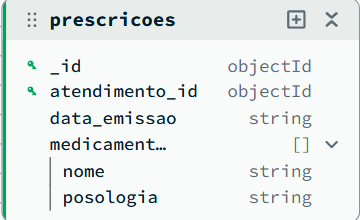
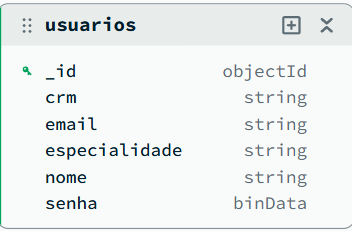

# ProntuDinamico

Sistema de prontuário eletrônico médico com **ficha clínica dinâmica por especialidade**, desenvolvido com Flask e MongoDB seguindo a arquitetura MVC.

---

## Sobre o Projeto

O diferencial do ProntuDinamico é que os campos do formulário de atendimento **não são fixos no código** — eles são carregados do banco de dados de acordo com a especialidade médica selecionada. Isso demonstra na prática o poder do MongoDB como banco de dados NoSQL orientado a documentos, onde cada atendimento pode ter uma estrutura completamente diferente.

### Funcionalidades

- Cadastro e autenticação de médicos com senha criptografada (bcrypt)
- Registro de atendimentos com ficha clínica dinâmica por especialidade
- Anexo de imagens de exames ao prontuário
- Busca por nome do paciente, CPF e filtro por especialidade
- Emissão de prescrição médica vinculada ao atendimento
- Edição e exclusão de prontuários e prescrições
- Trava de identidade: apenas o médico responsável pelo atendimento pode editar, excluir ou emitir a receita

### Especialidades disponíveis

| Especialidade | Campos clínicos |
|---|---|
| Psiquiatria | Relatório Comportamental e Emocional |
| Ortopedia | Membro Acometido, Nível de Dor, Histórico de Trauma |
| Dermatologia | Tipo de Lesão, Região do Corpo, Evolução e Conduta |
| Odontologia | Dente/Região, Procedimento, Plano de Tratamento |
| Oftalmologia | Acuidade Visual, Pressão Intraocular, Diagnóstico |
| Cardiologia | Pressão Arterial, Frequência Cardíaca, Laudo ECG |

---

## Arquitetura MVC

```
ProntuDinamico/
├── app.py                          # Ponto de entrada, registro dos Blueprints e filtros Jinja2
├── config/
│   └── database.py                 # Conexão com o MongoDB (lê MONGO_URI do ambiente)
├── models/
│   ├── prontuario_model.py         # Model: coleção atendimentos e especialidades
│   └── usuario_model.py            # Model: coleção usuarios (bcrypt)
├── controllers/
│   ├── auth_controller.py          # Blueprint: /login, /cadastro, /logout
│   ├── prontuario_controller.py    # Blueprint: / (listagem), /novo, /editar, /excluir
│   └── prescricao_controller.py    # Blueprint: /atendimento/<id>/prescricao
├── templates/
│   ├── login.html
│   ├── cadastro.html
│   ├── index.html                  # Listagem com busca por CPF/Nome e filtro por especialidade
│   ├── novo_prontuario.html        # Formulário com campos dinâmicos montados via JavaScript
│   ├── nova_prescricao.html
│   ├── editar_prontuario.html
│   └── editar_prescricao.html
├── static/
│   └── uploads/                    # Imagens de exames anexadas pelos médicos
├── data/                           # Dump das colecoes MongoDB em JSON (usado pelo seed)
│   ├── especialidades.json
│   ├── atendimentos.json
│   ├── prescricoes.json
│   └── usuarios.json
├── docs/                           # Diagramas e imagens do projeto
│   ├── diagrama_conceitual.png
│   ├── modelo_alto_nivel.png
│   ├── baixo_nivel_atendimentos.png
│   ├── baixo_nivel_especialidades.png
│   ├── baixo_nivel_prescricoes.png
│   └── baixo_nivel_usuarios.png
├── seed.py                         # Popula o MongoDB automaticamente na primeira execução
├── Dockerfile                      # Imagem da aplicação Flask
├── docker-compose.yml              # Orquestra Flask + MongoDB + Seed
└── requirements.txt
```

---

## Etapa 2 — Modelo Conceitual

Diagrama Entidade-Relacionamento do sistema, elaborado com notação ER no brModelo.



**Relacionamentos:**
- `USUARIO` **PERTENCE A** `ESPECIALIDADE` (1,1) — cada médico pertence a uma especialidade
- `USUARIO` **REALIZA** `ATENDIMENTO` (0,n) — um médico realiza vários atendimentos
- `ESPECIALIDADE` **CLASSIFICA** `ATENDIMENTO` (0,n) — uma especialidade classifica vários atendimentos
- `ATENDIMENTO` **GERA** `PRESCRICAO` (0,1) — um atendimento gera no máximo uma prescrição

O atributo `anamnese_dinamica` é representado como **multivalorado composto** — sua estrutura interna varia conforme a especialidade do atendimento, justificando o uso do MongoDB como banco NoSQL.

---

## Etapa 3 — Modelagem Logica

### Alto Nivel

Mapeamento conceitual-lógico das coleções e seus relacionamentos:



### Baixo Nivel

Estrutura real dos documentos de cada coleção no MongoDB:

| Colecao | Schema |
|---|---|
| `especialidades` |  |
| `atendimentos` |  |
| `prescricoes` |  |
| `usuarios` |  |

O campo `anamnese_dinamica` aparece com tipo `{}` (mixed) na coleção `atendimentos`, evidenciando o documento polimórfico — onde a estrutura interna varia por especialidade. O campo `imagem_url` aparece como `(mixed)` pois pode ser string ou null dependendo do atendimento.

---

## Etapa 4 — Scripts de Criacao e Insercao de Dados

No MongoDB não existem scripts DDL (`CREATE TABLE`, `CREATE DATABASE`) como no SQL. O banco de dados `prontu_db` e suas coleções são criados automaticamente pelo PyMongo no momento da primeira inserção — isso é uma característica fundamental do NoSQL orientado a documentos.

### Script de criação do banco — `config/database.py`

Equivalente ao `CREATE DATABASE` do SQL. Estabelece a conexão e retorna a instância do banco:

```python
from pymongo import MongoClient
import os

def get_database():
    CONNECTION_STRING = os.environ.get("MONGO_URI", "mongodb://localhost:27017/")
    client = MongoClient(CONNECTION_STRING)
    return client['prontu_db']  # cria o banco automaticamente se não existir
```

### Script de inserção de dados — `seed.py`

Equivalente aos `INSERT INTO` do SQL. Popula as 4 coleções do banco com dados reais:

```python
# Importa os JSONs da pasta /data e insere no MongoDB
db[colecao].insert_many(documentos)
```

Para rodar manualmente:
```bash
python seed.py
```

### Dados iniciais — pasta `/data`

Os arquivos JSON são o equivalente aos scripts de `INSERT INTO`:

| Arquivo | Colecao | Registros |
|---|---|---|
| `data/especialidades.json` | `especialidades` | 6 especialidades com campos clínicos |
| `data/atendimentos.json` | `atendimentos` | 13 atendimentos com anamnese dinâmica |
| `data/prescricoes.json` | `prescricoes` | 5 prescrições médicas |
| `data/usuarios.json` | `usuarios` | 5 médicos cadastrados |

> O `seed.py` só insere dados se a coleção estiver vazia, evitando duplicatas. Para reimportar, use `docker compose down -v` antes de subir novamente.

---

## Banco de Dados — MongoDB (NoSQL)

Banco: `prontu_db` | 4 coleções

### `usuarios`
Médicos cadastrados no sistema.
```json
{
  "_id": "ObjectId",
  "nome": "Gabriel Soares Avelino",
  "crm": "123456/MG",
  "email": "medicoexemplo@gmail.com",
  "senha": "$2b$12$... (bcrypt hash)",
  "especialidade": "Psiquiatria"
}
```

### `especialidades`
Define os campos dinâmicos de cada especialidade. É aqui que o sistema decide quais inputs exibir no formulário de atendimento.
```json
{
  "nome": "Ortopedia",
  "campos": [
    { "nome_campo": "membro_afetado",   "rotulo": "Membro / Osso Acometido", "tipo": "text" },
    { "nome_campo": "nivel_dor",        "rotulo": "Nivel de Dor (0 a 10)",   "tipo": "number" },
    { "nome_campo": "historico_trauma", "rotulo": "Houve Trauma ou Queda?",  "tipo": "text" }
  ]
}
```

### `atendimentos`
Documento polimórfico — o campo `anamnese_dinamica` muda de estrutura conforme a especialidade.
```json
{
  "_id": "ObjectId",
  "paciente_nome": "Joao da Silva",
  "paciente_cpf": "12345678900",
  "paciente_idade": "35",
  "paciente_genero": "Masculino",
  "paciente_contato": "(31) 99999-9999",
  "medico_id": "ObjectId do medico",
  "medico_nome": "Gabriel Soares Avelino",
  "especialidade": "Ortopedia",
  "data_consulta": "18/07/2026 14:30",
  "imagem_url": "/static/uploads/exame.jpg",
  "anamnese_dinamica": {
    "membro_afetado": "Joelho direito",
    "nivel_dor": "7",
    "historico_trauma": "Queda de bicicleta"
  }
}
```

### `prescricoes`
Receitas vinculadas a um atendimento específico.
```json
{
  "_id": "ObjectId",
  "atendimento_id": "ObjectId do atendimento",
  "data_emissao": "18/07/2026",
  "medicamentos": [
    { "nome": "Ibuprofeno 600mg", "posologia": "1 comprimido de 8 em 8 horas por 5 dias" }
  ]
}
```

---

## Como Executar

Existem duas formas de rodar o projeto: com **Docker** (recomendado) ou **manualmente** com Python e MongoDB local.

---

## Opcao 1 — Docker (recomendado)

### Pre-requisitos

- [Docker Desktop](https://www.docker.com/products/docker-desktop/) instalado e rodando

### Passos

```bash
# 1. Clone o repositório
git clone https://github.com/soaresavelino/ProntuDinamico.git
cd ProntuDinamico

# 2. Suba tudo com um único comando
docker compose up --build
```

Acesse: **http://localhost:5000**

O que acontece nos bastidores:
1. **`mongo`** — sobe o MongoDB 7 e aguarda ficar saudável
2. **`seed`** — executa o `seed.py` que importa os 4 JSONs da pasta `/data` para o banco
3. **`app`** — constrói a imagem Flask e sobe a aplicação, já com banco populado

> Na primeira execução pode demorar ~30 segundos até o seed terminar. Aguarde e recarregue a página se necessário.

```bash
# Parar sem apagar os dados
docker compose down

# Parar e resetar o banco (próxima subida reimporta os JSONs)
docker compose down -v
```

---

## Opcao 2 — Execucao Manual

### Pre-requisitos

- [Python 3.10+](https://www.python.org/downloads/)
- [MongoDB Community Server](https://www.mongodb.com/try/download/community) rodando na porta `27017`

### Passos

```bash
# 1. Clone o repositório
git clone https://github.com/soaresavelino/ProntuDinamico.git
cd ProntuDinamico

# 2. Crie e ative o ambiente virtual
python -m venv venv
venv\Scripts\activate        # Windows
# source venv/bin/activate   # Linux/macOS

# 3. Instale as dependências
pip install -r requirements.txt

# 4. Popule o banco (importa os dados da pasta /data automaticamente)
python seed.py

# 5. Suba a aplicação
python app.py
```

Acesse: **http://localhost:5000**

---

## Usuarios de Teste

Os seguintes médicos já estão importados pelo seed. Use para testar o login:

| Nome | E-mail | Especialidade |
|---|---|---|
| Gabriel Soares Avelino | medicoexemplo@gmial.com | Psiquiatria |
| Ian Baptista | ianbaptista@gmail.com | Ortopedia |
| Kaua | kaua@gmail.com | Dermatologia |
| Michael Joseph Jackson | dr.michael@michaeljackson.med.br | Odontologia |
| Camille Silva Oliveira | draCamille@gmail.com | Cardiologia |

> As senhas são as cadastradas originalmente. Caso não lembre, crie um novo usuário em `/cadastro`.

---

## Tecnologias Utilizadas

| Tecnologia | Uso |
|---|---|
| Python 3 + Flask | Backend e roteamento via Blueprints |
| MongoDB 7 | Banco NoSQL com documentos polimórficos |
| PyMongo | Driver Python para MongoDB |
| bcrypt | Hash seguro de senhas |
| Docker + Compose | Containerizacao e orquestracao dos servicos |
| Jinja2 | Engine de templates HTML |
| Bootstrap 5 | Interface responsiva |
| JavaScript | Montagem dinâmica dos campos do formulário |
